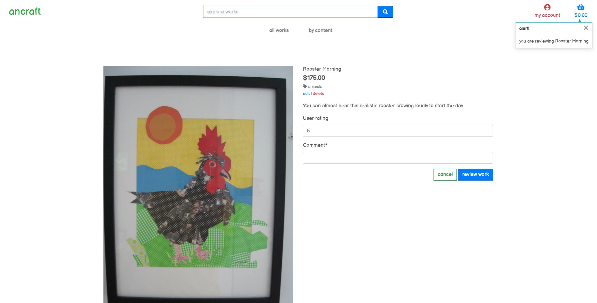
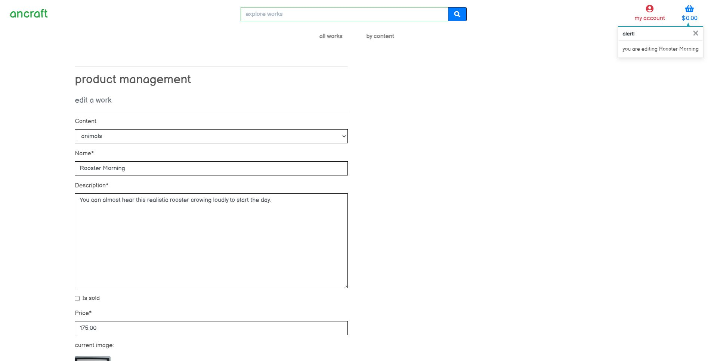

<h1 align="center">Milestone Project 4 - ancraft - Ant Romano</h1>

[View the live project here](https://mp4ancraft.herokuapp.com/works/)

An art ecommerce website designed using Python, HTML, CSS, JavaScript, Bootstrap, Django, Stripe, Heroku and Amazon S3 to highlight skills learned during Full Stack Software Development coursework.

<h2 align="center"></h2>

## User Experience (UX)

Designed to provide a simple experience for people to purchase unique art while highlighting software development skills.

-   ### User stories

    -   #### Customer

        1. As a customer, I want to browse the available artwork.
        

        2. As a customer, I want a simple user interface and functional interactivity.
        

        3. As a customer, I want to rate and leave comments on the artwork.
        
        
        4. As a customer, I want a recognizable and secure checkout experience.
        

        5. As a customer, I want an order summary and confirmation.
        

    -   #### Store Owner

        1. As the store owner, I want to easily edit and delete available artwork.
        

-   ### Design
    -   #### Color Scheme
        -   The main colors used are green, red, blue and white to match the art pieces's color pallette.
    -   #### Typography
        -   Balsamiq Sans font is the main font used throughout the whole website.
    -   #### Imagery
        -   Utilized Python, HTML, Python, and CSS.
    -   #### Data Schema

        -   Using Django provides many benefits in the development of this app. Its flexible schema makes it easy to evolve and store data in a way that is easy to work with. Django is also built to scale up quickly and supports all the main features of modern databases such as transactions.
        
        - Categories

                {   
                    "_id": ObjectId
                    "category_name": String
                }

        - Users

                {   "first_name": String
                    "last_name": String
                    "username": String 
                    "password": String
                }

        - status

                {   
                    "_id": ObjectId
                    "status": String (PK)
                }

        - projects

                {
                    "_id": ObjectId
                    "category_name": String
                    "project_name": String
                    "project_description": String
                    "is_urgent": String 
                    "due_date": Date
                    "status_name": String
                }

*   ### Wireframes

    -   The Balsamiq Cloud Wireframe providing framework for development is accessible [here](docs/ancraft_balsamiq.pdf)

## Features

-   Responsive on all device sizes.

-   Attractive, efficient and interactive elements.

## Features Left to Implement/Other Feature Ideas

-   Implement "Are you sure you want to delete?" functionality for store owners.
-   Ratings and comments superuser approval functionality.

## Technologies

### Languages

-   [Python](https://en.wikipedia.org/wiki/Python)
-   [HTML5](https://en.wikipedia.org/wiki/HTML5)
-   [CSS3](https://en.wikipedia.org/wiki/Cascading_Style_Sheets)
-   [JavaScript](https://en.wikipedia.org/wiki/JavaScript)

### Frameworks, Libraries & Programs

1. [Django:](https://www.djangoproject.com/)
    - for database.
1. [Heroku:](https://www.heroku.com/)
    - for deployment.
1. [Amazon S3:](https://aws.amazon.com/s3/)
    - for Cloud Object Storage.
1. [Stripe:](https://stripe.com)
    - for online payment processing.
1. [GitHub:](https://github.com/antfromano/milestone-project-4)
    - as a repository, distributed version-control system for tracking changes and to deploy and host final version of code.
1. [Gitpod:](https://gitpod.io/)
    - as a collaborative development environment.
1. [Balsamiq:](https://balsamiq.com/)
    - Balsamiq was used to create the [wireframes](docs/ancraft_balsamiq.pdf) during the design process.

## Testing

The W3C Markup Validator and W3C CSS Validator Services were used to validate every page of the project to ensure there were no syntax errors in the project.

-   [W3C Markup Validator](https://validator.w3.org/) - [Results](docs/Nu_Html_Checker.pdf)
-   [W3C CSS Validator](https://jigsaw.w3.org/css-validator/) - [Results](docs/W3C_CSS_Validator_results.pdf)

Lighthouse was also used to validate the project for performance, accessability, best practices and SEO.

-   [Lighthouse](https://developers.google.com/web/tools/lighthouse) - [Desktop Results](docs/lighthouse_desktop_results.pdf)

-   [Lighthouse](https://developers.google.com/web/tools/lighthouse) - [Mobile Results](docs/lighthouse_mobile_results.pdf)

### Testing User Stories from User Experience (UX)

-   #### Customer Goals

    1. As a customer, I want to browse the available artwork.

        1. Upon entering the site, customers are greeted with a simple title, several drop-down menus, search bar, my account, shopping cart and an explore works button which allows them to browse every art piece with one click.
        2. The my account button is immediately noticeable which leads the customer to the appropriate pages.
        3. The customer can input search requirements and hit search to search the available artwork.
 
    2. As a customer, I want a simple user interface and functional interactivity.

        1. The site has been designed to be simple to navigate. 
        2. Each page is laid out evenly and works cleanly when the images and art content are clicked and the cart is updated when artwork is added.
        3. The ancraft title allows the customer to view all works any time they wish.

    3. As a customer, I want to rate and leave comments on the artwork.
        1. The review button is front and center and easily recognizable.
        2. The ratings and comments form is simple and user friendly.
        3. After reviewing the work the customer is redirected back to the work review to view their rating and comments.

    4. As a customer, I want a recognizable and secure checkout experience.
        1. The colors and contrasts utilized make the text and buttons stand out.
        2. Flash messages confirm inputs, edits and deletes
        3. The colorful combinations and highlights add to the user experience.
    
    5. As a customer, I want an order summary and confirmation.
        1. Upon checking out, customers are given and order summary and confirmation.
        2. The specifics of the order are neatly and recognizably organized.
        3. When returning to the site, registered users can access their order history.

-   #### Store Owner Goals

    1. As the store owner, I want to easily edit and delete available artwork.
        1. The edit and delete buttons are visible on the multiple and singular artwork pages.
        2. The edit a work form is simple with appropriate fields neatly formatted.
        3. Upon updating work, store owner is is redirected back to the work to view their updates.

### Further Testing

-   Tested all features on the application to ensure that functionality is fully working.
-   Tested on Google Chrome, Internet Explorer and Microsoft Edge.
-   Viewed on variety of devices such as Desktop, Chromebook and Pixel 3a XL.
-   Testing was done to ensure that all pages linked correctly.
-   Friends and family were asked to review site and documentation for any bugs and/or user issues.
-   Tested all buttons and inputs extensively.

### Known Bugs

-   Add work, edit work and inputs are sometimes not immediately displayed.
-   As these are unique and one of a kind items, sold items are aren't available for purchase and would need to be refreshed with new items to keep store open.
-   On very wide screens some forms and tables aren't fully centered.

## Deployment

### Heroku

Project was deployed to Heroku with the following steps...

1. Log in to Heroku and click the “new” dropdown button on the dashboard and select “create new app”
2. Name your app (the name must be unique) and ensure the correct region has been set for where you are. 
3. Click “create app”.
4. In the terminal in your app type “npm install -g heroku” and hit enter to install Heroku into your app. The “-g” installs Heroku globally across your project. 
5. Log in to Heroku in the terminal by using “Heroku login -I” then input your email address and password for Heroku.

### Forking the GitHub Repository

Forking the GitHub Repository makes an original repository copy on oGitHub account for viewing and/or making changes but not affecting original repository achieve with the following steps.

1. Log in GitHub and locate [GitHub Repository](https://github.com/)
2. At top of Repository, locate "Fork" Button where there is now a copy of original repository.

### Making a Local Clone

1. Log in GitHub and locate [GitHub Repository](https://github.com/)
2. Under repository name, select "Clone or download".
3. For cloning repository using HTTPS copy the link under "Clone with HTTPS".
4. Open Git Bash and modify current working directory to location of your preferred cloned directory.
5. Input `git clone`, and paste copied URL from Step 3.

```
$ git clone https://github.com/antfromano/milestone-project-4
```

6. Press Enter. Local clone is created.

```
$ git clone https://github.com/antfromano/milestone-project-4
> Cloning into `CI-Clone`...
> remote: Counting objects: 10, done.
> remote: Compressing objects: 100% (8/8), done.
> remove: Total 10 (delta 1), reused 10 (delta 1)
> Unpacking objects: 100% (10/10), done.
```

Click [Here](https://help.github.com/en/github/creating-cloning-and-archiving-repositories/cloning-a-repository#cloning-a-repository-to-github-desktop) to retrieve pictures for some of the buttons and more detailed explanations of the above process.

## Credits

### Code

-   [Bootstrap:](https://getbootstrap.com) used to make site responsive.

-   [Boutique Ado](https://github.com/Code-Institute-Solutions/boutique_ado_v1): As an invaluable guide to develop site.

### Content

-   All content was written by the developer.

-   The format for README.md was taken from [here](https://github.com/Code-Institute-Solutions/SampleREADME/blob/master/README.md)


### Acknowledgements

-   Mentorship and guidance provided by Rahul Lakhanpal from Code Institute

-   Tutor support at Code Institute for their support.

-   I received inspiration for this project from [haydal810](https://github.com/Code-Institute-Submissions/haydal810-Milestone-Project-4)
